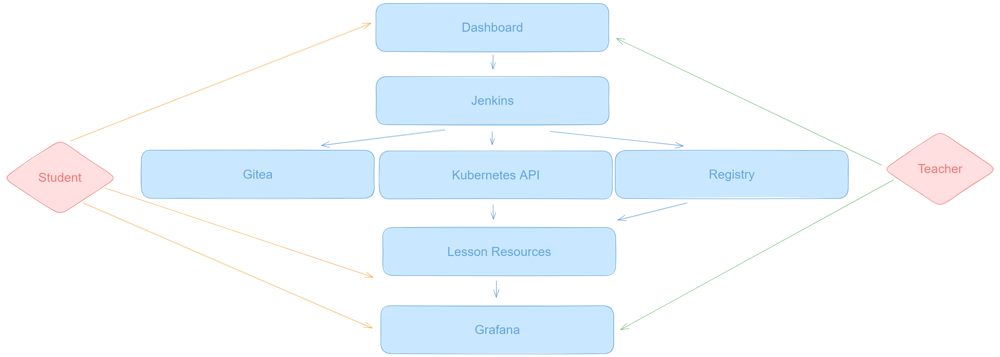

# hs-security-lessons

A framework to deploy, manage, and curate security training modules for high school students.

The goal of this project is multi-fold, but focused around the central theme of removing toil from generating repeated infrastructure and customizing/tweaking resources for the purpose of teaching security concepts to high school students.

_From the professor's perspective:_ One should be able to curate lesson plans, identify completed exercises, and quickly be able to identify student progress to maximize the time spent teaching while minimizing the red tape of multiple requests from multiple teams. (i.e. someone shouldn't spend time with IT, they should be doing what they're best at: teaching.)

_From the student's perspective:_ One should be able to easily be able to access a curated lesson, understand the objectives, and complete the exercise with minimal touch points from the professor to maximize the value of time spent when that touch point is required. (i.e. someone shouldn't need admin support, but rather educational support.)

My personal goal is to demonstrate web infrastructure technologies to apply to common technical road-blocks in new and unnecessary ways.

## Infrastructure Overview

A diagram showing service distribution:


A demonstration of the dashboard experience from the user's perspective. It shows a Jenkins trigger, created k8s resources, the generated Grafana Dashboard, the lesson README, and exposed endpoints at a glance.


#### A TL;DR of the Actual Infrastructure

The k8s service itself is just kubeadm created, 1 raspberry pi 5 with an SSD for a controller, and 3x SFF HP EliteDesk 800 Gen 1 for worker nodes. It's exposed with a Protectli hardware appliance running VyOS, and connected with a dumb 8 port switch.

The cluster is running several services to automate the infra provisioning, and can be scaled to real hardware using these same configurations:

- MayaStor OpenEBS for storage
- MetalLB for load balancing
- KubeVirt for importing and exporting KVM VMs
- Prometheus for cluster monitoring
- InfluxDB for every other monitoring
- CoreDNS/Flannel for DNS and networking

## Current State

The majority of infrastructure is deployed via Ansible and services must be discovered (provisioned through DHCP and MetalLB) manually for the time being.
VyOS/External Routing must be configured manually, a running configuration can be found in ./manual-configs

#### Jenkins is configured to do the following:

- Deploy on-demand kustomize manifests to the cluster based on k8s manifests in the cluster gitea instance.
- Cleanup of resources when queried.
- Auto-triggers a rebuild of custom container images whenever a Dockerfile is updated in the gitea instance.

#### A custom dashboard exposes these features:

- User management interface to control admin (`teacher`) and student (`student`) access.
- Cluster cleanup interface to remove all resources from the cluster after lessons complete.
- Lesson management interface to deploy and manage lessons.
- Link generator to provide students with a unique link to access their cluster resources and remote access.
- Auto-generated lesson dashboards via gitea READMEs.

#### To generate the secrets vault for managing ansible, one can run the following commands after copying the vault.yml.sample to vault.yml:

```
ansible-vault create --vault-id credentials@prompt ansible/group_vars/all/vault.yml
ansible all --ask-vault-pass -i inventory -m debug -a "msg='User: {{ ansible_user }} / Password: {{ ansible_password }}'"

create vault password in ~/.ansible/credentials; chmod 0600
```

#### To run the playbooks, one can run the following commands:

```
# Build the linux nodes
ansible-playbook -i inventory roles/linux/tasks/main.yml

# Configure the cluster
ansible-playbook -i inventory roles/kubernetes/main.yml
```

# Interfacing With The Non-Lesson Based Features Of This Cluster

## accessing raw cluster components

1. Ansible will have provisioned an admin kubeconfig in your ~/.kube/config.hscluster file. You can use this to access with the following tools:
   - [k9s](https://k9scli.io/topics/install/)
   - [kubectl](https://kubernetes.io/docs/tasks/tools/#kubectl)
1. Export the kubeconfig to your environment with `export KUBECONFIG=~/.kube/config.hscluster` to use any of these tools.

## Ubuntu Vm Base Prep For Kubevirt

> Future iterations will include Jenkins pipelines to automate this process and export VMs to an easily reachable location.

1.  install ubuntu desktop
1.  give user/pass ubuntu:ubuntu
1.  install `openssh-server`
1.  run playbook
1.  install `qemu-utils` locally
1.  ensure vhdx is merged properly and not split into snapshot layers
1.  run `qemu-img convert -f vhdx -O qcow2 ubuntu-vm-base.vhdx ubuntu-vm-base.qcow2`
1.  install virtctl

            export VERSION=v0.41.0
            wget https://github.com/kubevirt/kubevirt/releases/download/${VERSION}/virtctl-${VERSION}-linux-amd64

1.  Add port forward 18443:8443 to uploadproxy.
1.  upload image

            virtctl image-upload dv ubuntu-base --namespace kubevirt-images --size=20Gi --image-path ../images/ubuntu.qcow2 --uploadproxy-url=https://127.0.0.1:18443 --insecure --access-mode ReadWriteOnce --volume-mode filesystem

## Updating and Deploying Lessons

> Future iterations will include a webgui of a vscode-like interface to help with this process.

1. Browse to the gitea instance and navigate to the lesson you wish to update.
1. Update it in the gitea instance or clone the repository and work on it locally.

## Updating and Deploying the Dashboard

> Future iterations will auto-deploy this into the cluster.

1. Browse to the GITHUB registry, and update accordingly.
1. Manually `docker build` and `docker push` to the in-cluster registry.
